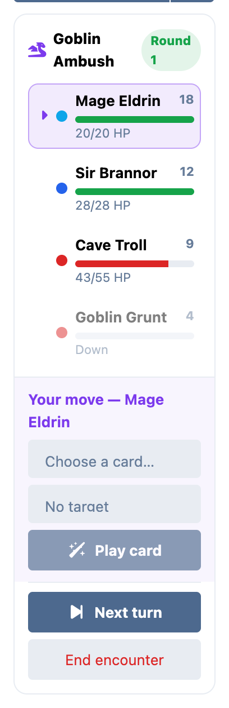
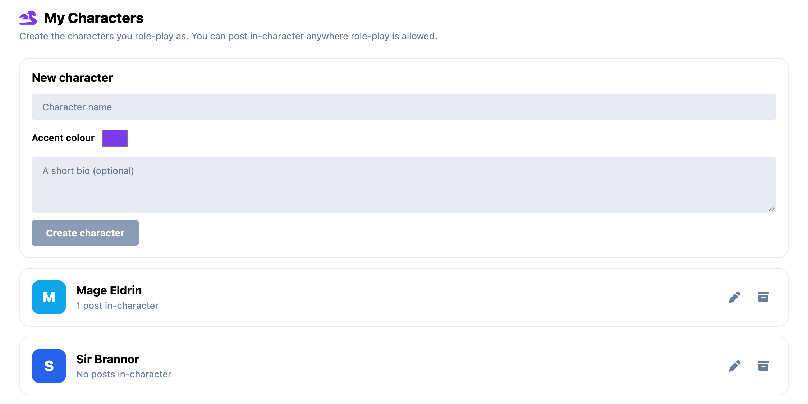
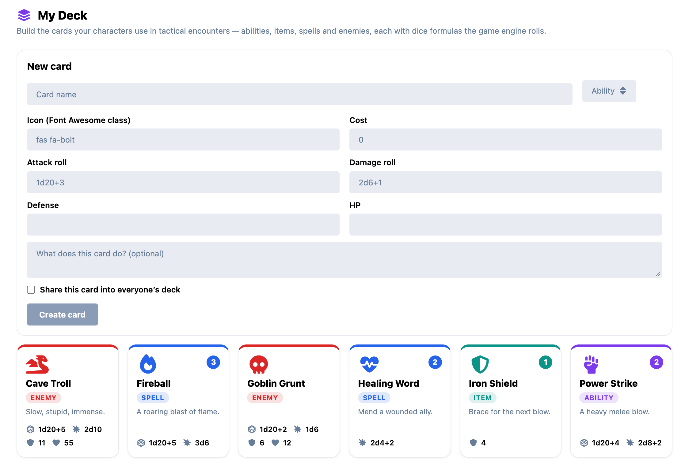

# Role-Play for Flarum

**Play a character, post in-character, and run a card-based tactical game — right inside your Flarum discussions.**

[](LICENSE)
[](https://flarum.org)

Role-Play turns an ordinary Flarum forum into a home for tabletop-style play. Members create characters, write posts *as* those characters, and storytellers can run full turn-based combat encounters — with dice, cards, initiative and live HP bars — without anyone leaving the thread.

It touches **no core tables** (everything lives in its own `rp_*` tables) and is **free and MIT-licensed**.

<p align="center">
  
</p>

---

## Three features, one extension

### 🎭 Characters

Members manage their cast at **`/characters`** ("My Characters" in the account menu): a name, an accent colour, an optional avatar and bio. Characters are yours; archive them any time and their old posts keep their identity.



### 💬 Post in-character

When replying, pick **"Post as …"** in the composer and your reply is authored as that character — its coloured badge and name replace your own, with a quiet *"Played by you"* underneath so nothing is hidden. Perfect for narrative threads where several people each speak as their characters.

### ⚔️ A tactical card game

This is where Role-Play goes further than any other Flarum RP add-on. Build a **deck** of cards, then run **encounters** — turn-based fights that play out live in the discussion sidebar.

---

## The deck builder

At **`/deck`** ("My Deck" in the account menu) each member crafts cards — **abilities, items, spells and enemies** — each with dice formulas the game engine actually rolls:

- **Attack roll** (e.g. `1d20+5`) — checked against the target's defense
- **Damage roll** (e.g. `3d6`) — applied on a hit, **doubled on a natural-max crit**
- Optional **defense**, **HP**, **cost**, a **Font Awesome icon**, and a description
- Mark a card **public** to share it into everyone's deck



Dice expressions are validated server-side — a malformed formula is rejected, never silently ignored.

---

## Running an encounter

Any member can start an encounter inside a discussion and becomes its **storyteller (GM)**. From the tracker in the sidebar you:

1. **Build the field** — add party members and foes by hand, **spawn a foe straight from an enemy card** (its HP and defense seed automatically), and let players **join with one of their own characters**.
2. **Roll initiative & start** — every combatant rolls `1d20 + agility`; the tracker sorts them into turn order.
3. **Play it out** — on each turn the active combatant **plays a card at a target**. The engine rolls to-hit vs. defense, rolls damage on a hit (×2 on a crit), and updates HP. A rolling **action log** narrates every play — hits, misses and crits.
4. **Advance** until one side is down — a **Victory / Defeat banner** appears, and the GM ends the encounter.

The tracker shows the initiative order, colour-coded HP bars (green party / red foes), the active turn, and adapts its controls to who's looking — the GM drives the fight; a player only acts on their own character's turn.

### Live for the whole table

When [flarum/realtime](https://flarum.org) is installed, every play, turn and HP change is **broadcast over WebSocket** — the whole table sees the fight update instantly, no refresh. Without realtime, the tracker falls back to a lightweight poll, so it still stays in sync.

---

## Installation

```bash
composer require ernestdefoe/roleplay
php flarum cache:clear
```

That's it — the six `rp_*` tables are created automatically on enable. Then:

- Members find **My Characters** and **My Deck** in their account menu.
- Anyone can start an encounter from a discussion's sidebar.
- For instant multi-viewer combat, install and configure **flarum/realtime** (optional).

### Requirements

- Flarum **2.0+**
- PHP 8.1+
- *(Optional)* flarum/realtime for live updates

---

## How the dice work

The engine (`src/Game.php`) is a small, pure core:

| Step | Rule |
|------|------|
| **Dice** | Any `XdY+Z` expression, e.g. `2d6+1`, `1d20`, `3d8-2` |
| **Initiative** | `1d20 + agility`, highest goes first |
| **To-hit** | Attack total ≥ target defense (defense `0` = always hits) |
| **Crit** | A natural maximum on any attack die → **double damage** |
| **Down** | A combatant at `0` HP is out; turns skip them |

---

## Building from source

The PHP runs as-is; the front-end compiles with the Flarum webpack toolchain:

```bash
cd js
npm install
npm run build
```

---

## License

[MIT](LICENSE) © Ernest Defoe. Free to use, fork and build on.
